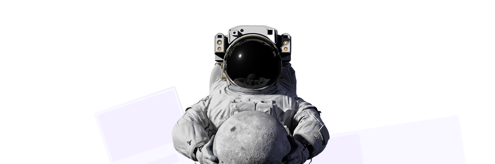
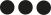

import { Meta, Canvas } from '@storybook/addon-docs/blocks';
import { Badge } from '@storybook/components';
import { getStorybook, storiesOf} from '@storybook/react';
import { storage } from '@space-designsystem/pattern';
import LinkTo from '@storybook/addon-links/react';
import './images/background_space.png';
import './images/space-tokens.svg';
import './images/space-atoms.svg';
import './images/space-molecules.svg';
import './images/space-organisms.svg';
import './images/space-templates.svg';
import './welcome-page.css';

<Meta title="Welcome"
  parameters={{ viewMode: 'docs', previewTabs: { canvas: { hidden: true }}}}
/>

  

  <h1>SPACE Design system</h1>
  
A composable design system which can adapt to any brand requirements. SPACE can cater to industries and marketing websites of different kinds by making foundation-level changes to an existing ecosystem of design and code.

  
Space demo page with components from <a href="https://mertjf.github.io/tailblocks/" target="_blank">Tailblocks</a> and <a href="https://www.tailwindtoolbox.com" target="_blank"> tailwindtoolbox.com</a>.

  
Design and images from <a href="https://www.figma.com/file/dlWomhChdClRAEcn40SW0i/SPACE-Master-UI-Kit?type=design&t=RrYVGWg4zi3mGRRO-6" target="_blank"><u>SPACE Figma file.</u></a>

  
Design Documentation from <a href="https://www.notion.so/qed42epl/Space-DXP-9bbd88462ceb4b6a82b374e36c6959c0"><u>SPACE on Notion.</u></a>

  ##  Tokens
  <Canvas>
    

      <LinkTo story="page" kind="Tokens/Colors">
        <Badge status="neutral">Colors</Badge>
      </LinkTo>
    

    

      <LinkTo story="page" kind="Tokens/Typography">
        <Badge status="neutral">Typography</Badge>
      </LinkTo>
    

    

      <LinkTo story="page" kind="Tokens/Scale">
        <Badge status="neutral">Scale</Badge>
      </LinkTo>
    

    

      <LinkTo story="page" kind="Tokens/Icons">
        <Badge status="neutral">Icons</Badge>
      </LinkTo>
    

  </Canvas>

  ##  Atoms
  <Canvas>
    {
      storage.loadPatternsByNamespace('Atoms').map((pattern)=>{
        return (
          

            <LinkTo class={pattern.getId()} key={pattern.getId()} story={pattern.getDefaultVariant().getLabel()} kind={`${pattern.getNamespace()}-${pattern.getId()}`}>
              <Badge status="neutral">{pattern.getLabel()}</Badge>
            </LinkTo>
          

        )
      })
    }
  </Canvas>

  ##  Molecules
  <Canvas>
    {
      storage.loadPatternsByNamespace('Molecules').map((pattern)=>{
        return (
          

            <LinkTo key={pattern.getId()} story={pattern.getDefaultVariant().getLabel()} kind={`${pattern.getNamespace()}-${pattern.getId()}`}>
              <Badge status="neutral">{pattern.getLabel()}</Badge>
            </LinkTo>
          

        )
      })
    }
  </Canvas>

  ##  Organisms
  <Canvas>
    {
      storage.loadPatternsByNamespace('Organisms').map((pattern)=>{
        return (
          

            <LinkTo key={pattern.getId()} story={pattern.getDefaultVariant().getLabel()} kind={`${pattern.getNamespace()}-${pattern.getId()}`}>
              <Badge status="neutral">{pattern.getLabel()}</Badge>
            </LinkTo>
          

        )
      })
    }
  </Canvas>

